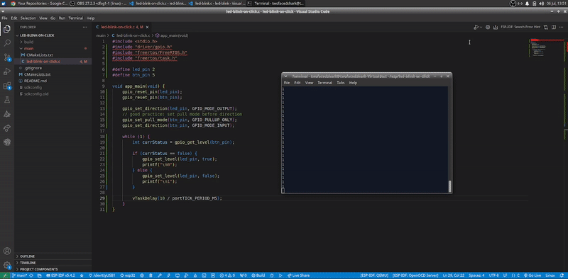

# click-btn-light-led

     
    <a href="https://www.youtube.com/watch?v=sThzwX8AuPA&list=PLOYsAys6a6mmeowMVksJWEIzdKOBMh20q&index=2&ab_channel=voidloopRobotech%26Automation" target="_blank" rel="noopener noreferrer">02 ESP32 GPIO Input with ESP-IDF and Embedded C using VS Code</a> 
     

## Hardware Requirements

*   ESP32
*   LED
*   Button
*   Resistor
*   Jumper wires
*   Breadboard

## Software Requirements

*   ESP-IDF

## Building and Installation

1.  Clone the repository: `git clone https://...`
2.  Open the project in VS Code using ESP-IDF
3.  Set the target: `idf.py set-target esp32`
4.  Set project configuration: `idf.py menuconfig`
3.  Build the project: `idf.py all`
4.  Connect ESP32 and check the serial port: `ls /dev/ttyUSB*`
4.  Flash the serial port: `idf.py -p /dev/ttyUSB0 flash`